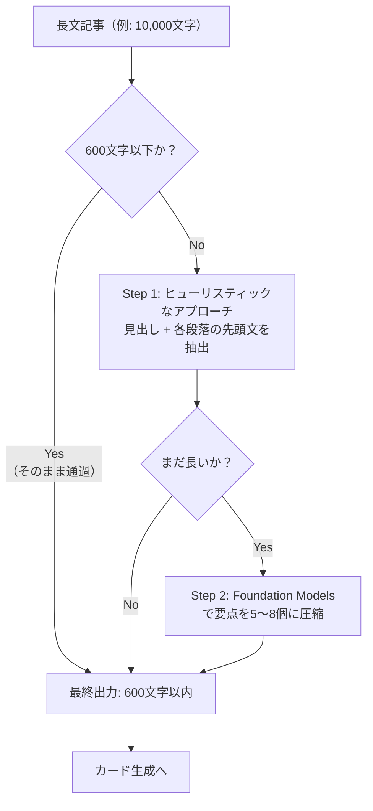

# はじめに

先日、フェンリル株式会社が主催したセミナーで、AppleのエンジニアからFoundation Modelsの活用方法を直接教わる機会がありました。
セミナーでは、Foundation Modelsの基本的な使い方から `@Generable` を用いた実装のアイデア共有まで、3時間のハンズオンで1つのサンプルアプリを作り上げる、非常に密度の濃い内容でした。
本記事は、その経験を踏まえて自分でゼロからアプリを組み立てる中で得た、Foundation Modelsの実践的な使いどころを整理したものです。

---

まず、Foundation Modelsの基本的な使い方（`@Generable`で型を定義して`session.respond()`で生成）は、WWDC25のセッションや公式ドキュメントで理解している方が多いと思います。
一方で、自分でセッションを用いたフローを組み込んだ方は少ないのではないかと感じます。

この記事では、「記事URLを共有するとAIがフラッシュカードを自動生成する」iOSアプリ「ArticleFlash」を開発する中で得た、Foundation Modelsの実践的なテクニックを4つ紹介します。

| # | テクニック | 課題 | 解決策 |
|---|-----------|------|--------|
| 1 | Streaming API | 生成完了まで画面が更新されない | `streamResponse()` + `PartiallyGenerated` で逐次表示 |
| 2 | トークン最適化 | `instructions` + `@Guide` でトークンが枯渇 | `instructions` を圧縮し、`@Guide` は最小限のキーワードに絞る |
| 3 | 再帰的要約 | 長文記事がトークン制限を超える | ヒューリスティック処理 → Foundation Modelsの二段構え |
| 4 | 意味的判定 | 文字列一致では判定が実用的でない | `@Generable` で `Bool` 型の判定結果を生成 |

## 作ったアプリ

まず、作ったアプリについて概要を紹介します。

SafariやGoogleなどのウェブブラウザで記事を読んだ後、


<br><br>
共有ボタンを押すとアプリが表示されるので、


<br><br>
アプリを選択すると、記事の内容をクイズ形式に変換したカードが生成されます。


<br><br>
アプリ内で1週間ごとに作成したカードがクイズ形式で出題されるため、


<br><br>
学んだことを自動的に復習できます。


<br><br>
……というアプリです。

それでは、このアプリでFoundation Modelsをどう使ったのか、冒頭の表に沿って4つのテクニックを順に見ていきます。

## 1. Streaming APIで「AIが考えている感」を演出
まず、カード生成部分からです。
Foundation Modelを勉強したての頃は`session.respond()`で結果を受け取ることに慣れますが、これでは3枚のカードがすべて生成されるまで処理を待つ必要があります。

そこで、`session.streamResponse()`を使うと、生成途中の結果を**逐次的に受け取れます。** これにより、カードが1枚完成するごとにアニメーション付きでUIに追加するプログレッシブUIを実現できます。
```swift
let stream = session.streamResponse( // ココ！
    to: prompt,
    generating: FlashcardCandidates.self
)

for try await snapshot in stream {
    if let cards = snapshot.content.cards {
        let validCards = cards.compactMap { candidate -> FlashcardCandidate? in
            guard let q = candidate.question, let a = candidate.answer else { return nil }
            return FlashcardCandidate(question: q, answer: a, tags: candidate.tags?.compactMap(\.self) ?? [])
        }
        if validCards.count > latestCards.count {
            latestCards = validCards
            onUpdate(latestCards)
        }
    }
}
```


なお、`for try await snapshot in stream` の `snapshot` は `ResponseStream.Snapshot` 型です。
そのため、中身にアクセスするには `snapshot.content` を経由する必要があります。

```
snapshot                          → ResponseStream<FlashcardCandidates>.Snapshot
snapshot.content                  → FlashcardCandidates.PartiallyGenerated
snapshot.content.cards            → [FlashcardCandidate.PartiallyGenerated]?
snapshot.content.cards?[i].question → String?  ← 全部Optional
```

`@Generable`構造体のプロパティは、ストリーミング中はすべて`Optional`になるため、`nil`の場合とそうでない場合で処理を明確に書き分ける必要があります。
Apple公式サンプルの [FoundationModelsTripPlanner](https://developer.apple.com/documentation/foundationmodels/adding-intelligent-app-features-with-generative-models) も同様に `partialResponse.content` 経由で `Itinerary.PartiallyGenerated?` を受け取っているので、このパターンがおそらく標準の作法だと考えられます。


## 2. `@Guide` と `instructions` のトークン効率を最適化
次に、記事の内容を実際に読み込ませることを考えます。

Foundation Modelsのコンテキストウィンドウには**入出力合計で4,096トークン**の制限があり、この中に以下がすべて詰め込まれます。
- `instructions`（システムプロンプト）
- `@Generable` のスキーマ
- ユーザープロンプト
- 記事テキスト
- Foundation Modelの出力

そのため、最初は少し長い記事を入れると `exceeded model context window size` となり、正常に動作しませんでした。
そこで、良い例と悪い例を**1行ずつに圧縮**すると、品質を維持しつつトークン消費を大幅に削減できます。

```swift
// Before: 約1,200トークン（34行）
private static let instructions = """
あなたは学習カード生成の専門家です。
与えられた記事から、記憶に残りやすいQ&Aフラッシュカードを日本語で3つ生成してください。

## ルール
- 質問は「〜とは何か」「〜の違いは」のような具体的な問い形式にする
...（中略・3パターンの良い例 + 3パターンの悪い例）
"""

// After: 約100トークン（6行）
private static let instructions = """
記事からQ&Aカードを日本語で3つ生成。ルール:
- 質問は「〜とは何か」形式で自己完結。答えは30字以内、キーワード文頭配置
- 3つは異なる要点をカバー。タグは技術名を1〜3個
良い例: Q:@Stateと@Bindingの違いは？ A:@Stateはビュー内部所有、@Bindingは親からの参照
悪い例: Q:この記事について説明して（漠然）/ A:〜を理解することが重要です（曖昧）
"""
```

これにより、**約1,100トークン節約**できました🙌

### 見落としがちな `@Guide` のコスト

`@Guide` の `description` は `@Generable` マクロがスキーマとしてプロンプトに**自動注入**します。つまり、description を長く書くほど、トークン制限を圧迫します。

```swift
// Before: 約220トークン消費
@Guide(description: """
記事の核心を突く具体的な質問。以下の条件を満たすこと:
- 「〜とは何か」「〜の役割は」のような具体的な問い形式
- 答えを知らない人が読んでも質問の意味が分かる自己完結した文
- 「〜について説明して」のような漠然とした質問は避ける
""")
var question: String

// After: 約30トークン消費
@Guide(description: "記事の核心を問う具体的な質問。自己完結した1文")
var question: String
```

:::note info
`@Guide` の `description` を短くしても生成品質が著しく落ちるわけではありません。`instructions` 側でルール・例を明示していれば、`@Guide` は最小限のキーワードで十分です。`instructions` と `@Guide` の **役割分担** を意識してください。
:::

### 最終的なトークン配分

| 項目 | トークン数 |
|------|-----------|
| instructions | ~100 |
| @Generable スキーマ | ~200 |
| プロンプト文 | ~20 |
| 記事テキスト | ~600 |
| 出力（3カード） | ~600 |
| **合計** | **~1,520** |

日本語はトークン消費が激しいことで有名ですが、[公式ドキュメント](https://developer.apple.com/documentation/foundationmodels/languagemodelsession/generationerror/exceededcontextwindowsize(_:))によると`1文字 ≈ 1トークン`とのことです😱
そのため、日本語でトークンを消費するアプリでは、テキストの絞り込みが特に有効です。

## 3. 4,096トークン制限を「再帰的要約」で突破する
前段で節約について述べましたが、記事が日本語の場合は4,096トークンが一気に消費されます。
かといってそのまま入力すると、後半にある重要な情報を取りこぼしてしまいます。

そこで、Foundation Modelを呼び出す前に**ヒューリスティックなアプローチでテキストを圧縮**し、それでも長い場合だけ再度要約する二段構えにしました。



### ヒューリスティックなアプローチ

記事の構造を利用し、**AIを使わずに**重要な情報を絞り込みます。

```swift
private static func extractKeySentences(from text: String, limit: Int) -> String {
    let paragraphs = text.components(separatedBy: "\n")
        .map { $0.trimmingCharacters(in: .whitespacesAndNewlines) }
        .filter { !$0.isEmpty }

    var result: [String] = []
    var totalLength = 0

    for paragraph in paragraphs {
        if paragraph.count < 60, !paragraph.contains("。") {
            // 見出し（短くて句点なし）→ そのまま採用
            result.append(paragraph)
            totalLength += paragraph.count
        } else {
            // 段落の先頭文（トピックセンテンス）を抽出
            if let first = firstSentence(of: paragraph) {
                result.append(first)
                totalLength += first.count
            }
        }
        if totalLength > limit * 2 { break }
    }
    return result.joined(separator: "\n")
}
```

「見出しは短くて句点がない」「段落の先頭文が最も重要」という日本語記事の構造的特徴を利用しています。

### `@Generable` を要約にも活用

ヒューリスティックだけでは不十分な場合、Foundation Modelsで要約します。ここでも `@Generable` が活躍します。

```swift
@Generable
struct Summary: Sendable {
    @Guide(description: "要点を箇条書きで5〜8個")
    var keyPoints: [String]
}

private static func aiSummarize(_ text: String, title: String) async throws -> String {
    let safeInput = String(text.prefix(800))
    let session = LanguageModelSession(
        instructions: "テキストの要点を日本語で5〜8個、各1文で抽出"
    )
    let response = try await session.respond(to: safeInput, generating: Summary.self)
    return response.content.keyPoints
        .prefix(8)
        .map { "・\($0)" }
        .joined(separator: "\n")
}
```

:::note info
`@Generable` は「生成」だけでなく「抽出・要約」にも使えます。`[String]`型で要点を構造化データとして取り出せるのは、JSONパース不要の `@Generable` ならではの強みです。
:::

### 多重防御のハードリミット

実際に運用すると、エッジケースでトークン制限を超えることがあります。そこで、**2段階のガードレールを設け**、制限を超えることを防ぎます。

```swift
// 1. 記事本文を600文字以内に圧縮
let condensedText = try await ArticleSummarizer.condense(bodyText, title: title)

// 2. Foundation Modelに入力するテキストを強制的に600字以内に制限
let safeText = String(article.bodyText.prefix(600))
```

ちなみにこの「分割から各セクションを新セッションで要約、結合、反復」のフローは、`LanguageModelSession`公式ドキュメントでも長文処理の推奨手順として挙げられているアプローチです。
コツは、**サブタスクごとに新しい`LanguageModelSession`を作成する**ことです。同一セッションを使い回すと前のセッションの内容が積み重なり、結果的にトークンが枯渇します。
## 4. `@Generable` で「生成」だけでなく「判定」もやる
最後に、ユーザーが回答を入力したときの正誤判定について解説します。
意味としておおむね合っていれば正解としたいため、完全な文字列一致判定は使えません。

- 模範解答: `@Stateはビュー内部所有、@Bindingは親から渡される参照`
- ユーザー回答: `@Stateはビュー自身が持つ状態で、@Bindingは親から渡される`

これは**意味的には正解**ですが、文字列比較では不正解になります。

`@Generable` で判定結果の型を定義し、AIによる意味的な正誤判定を実行します。

```swift
@Generable
struct JudgeResult: Sendable {
    @Guide(description: "判定理由を1文で具体的に")
    var reason: String

    @Guide(description: "正解ならtrue。キーワードや概念が含まれていれば表現違いでも正解")
    var isCorrect: Bool
}
```

ポイントは2つあります:

1. **`Bool` 型のプロパティにも `@Guide` を付けて判定基準を明示する**。「意味的に同じなら正解」という基準がなければ、モデルは厳密な文字列比較に偏りがちです。
2. **`reason` を `isCorrect` より先に宣言する**。`@Generable` は宣言順にプロパティを生成するため、先に理由を出力させると結論を急いで間違うことを防げます。
[公式ドキュメント](https://developer.apple.com/documentation/foundationmodels/prompting-an-on-device-foundation-model)でも *"Make sure the reasoning field is the first property"* と明記されている定石です。

### `instructions`へのFew-Shot判定例の包含

```swift
private static let instructions = """
回答の正誤を判定。日本語で出力。
基準: キーワード・概念が含まれれば表現違いでも正解。部分的でも核心が欠ければ不正解。
例: 「ビュー内部所有」≒「ビュー自身が持つ」→正解 / 「4096」≒「約4000」→正解
"""
```

また、同義語の判定例と数値の近似判定例（「4096」と「約4000」）を含めると、判定精度が安定します。

### フォールバック

Foundation Modelsが利用できない環境では、キーワードの一致率で判定します。
今回は簡易的な実装にしたため、本格的に対応する場合はCore MLを使うことを検討しています。

```swift
private static func fallbackJudge(correctAnswer: String, userAnswer: String) -> JudgeResult {
    let keywords = normalizedAnswer
        .components(separatedBy: CharacterSet.alphanumerics.inverted)
        .filter { $0.count >= 2 }
    let matchCount = keywords.filter { normalizedUser.contains($0) }.count
    let matchRatio = keywords.isEmpty ? 0.0 : Double(matchCount) / Double(keywords.count)

    let isCorrect = matchRatio >= 0.4
    return JudgeResult(
        isCorrect: isCorrect,
        reason: isCorrect ? "キーワードが一致" : "主要なキーワードが不足"
    )
}
```


## まとめ

実際にアプリへ組み込んでみて、Foundation Modelsの強みを強く実感できました。

- **オンデバイスで完結する**ため、ユーザーが読んだ記事の内容を外部サーバーに送らずに済みます。プライバシーを守りながら高度なAI機能を提供できるのは、Foundation Modelsならではの大きな価値です。
- **追加課金なし・通信不要**で動くため、サブスクや従量課金、オフライン環境を一切気にせず、すべてのユーザーがそのままAI機能を享受できます。
- **`@Generable` による型安全な構造化出力**のおかげで、文章生成だけでなく判定・要約タスクにも自然に応用でき、JSONパース不要で安全に扱える快適さは他のLLM活用にはない魅力でした。

`instructions`・`@Guide`・入力テキスト量のバランス調整は確かに腕の見せどころですが、それを乗り越えれば、クラウドLLMでは実現しづらいプライバシーフレンドリーでオフラインでも動くユーザー体験を、Appleプラットフォームの上で自然に提供できます。
Foundation Modelsの可能性をさらに掘り下げていきたいと、今回の開発を通じて改めて感じました。
